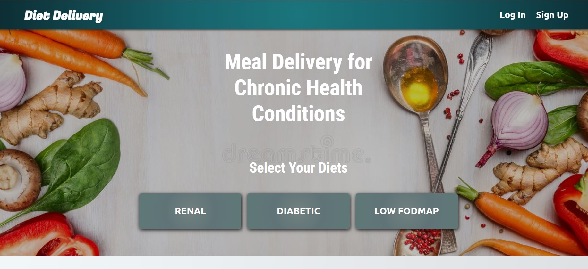

# Diet Delivery

## Description and Purpose
A web application for a meal delivery service that specializes in diets for chronic diseases, such as renal disease and diabetes.

## Table of Contents
  - [Description and Purpose](#description-and-purpose)
  - [Application Screenshot](#application-screenshot)
  - [Deployed Application](#deployed-application)
  - [Built With](#built-with)
  - [License](#license)
  - [Contributing](#contributing)
  - [Tests](#tests)
  - [Questions](#questions)

## Application Screenshot

## Deployed Application
https://diet-delivery.herokuapp.com/

## Built With
* JavaScript
* Node.js
* Express.js
* MySQL
* Sequalize
* Dotenv
* Handlebars.js
* HTML
* CSS
* Heroku
* JawsDB
* Bcrypt

## License
MIT License
(https://img.shields.io/badge/License-MIT-yellow.svg)](https://opensource.org/licenses/MIT)

## Contributing
As part of a team project within The Coding Bootcamp at UT Austin, this project was developed by the following:
* Mike Shelby
* Ricky Sullivan
* Chris Podoba
* Ayoub Hammouch
* Obinna Ezekwe

## Tests
All API end points were tested using Insomnia Core. Utility functions were tested using Jest.

## Questions
Github Username: mikegshelby

Github Profile: https://github.com/mikegshelby

Email: mikegshelby@gmail.com

Please email me with any questions about this project!
